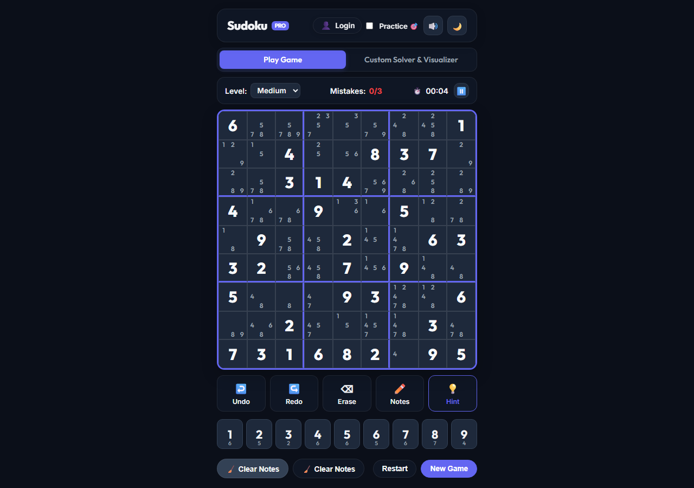
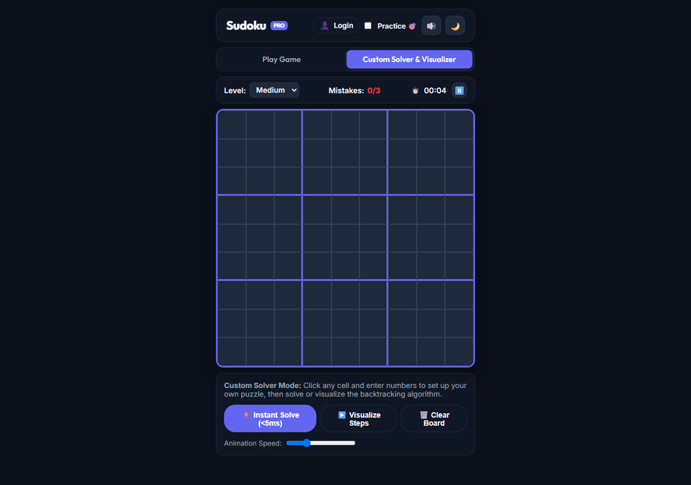

# Sudoku Pro

> A modern, high-performance Sudoku web application and logic solver built with pure web technologies (HTML5, Vanilla CSS3, ES6+ JavaScript).

Developed by **Priyanshu Shekhar**.

---

## Live Demo
- **Web Application**: https://priyanshushekhar1319.github.io/sudoku-pro/
- **GitHub Repository**: https://github.com/priyanshushekhar1319/sudoku-pro

---

## Screenshots

### Main Gameplay and Candidate Notes


### Custom Solver and Backtracking Visualizer


### Player Profile and Authentication System


---

## Overview

Sudoku Pro is a modern, responsive, zero-dependency Sudoku game engineered for speed, mathematical rigor, and aesthetic appeal. It features a canonical backtracking solver, a unique puzzle generator, an explainable logical hint system, and an interactive visualizer.

---

## Features

- **Interactive 9x9 Grid**: CSS Grid with responsive aspect-ratio, crosshair focus highlighting, and matching digit indicators.
- **4 Calibrated Difficulties**: Easy, Medium, Hard, and Expert levels.
- **Guaranteed Unique Solutions**: Every generated puzzle undergoes validation with countSolutions to ensure strictly one mathematically valid solution.
- **Explainable Hint Engine**: Rather than blindly filling a cell, the hint engine detects logical patterns such as Naked Singles and Hidden Singles, providing a human-readable explanation of why the move is mathematically certain.
- **Pencil Notes and Auto Notes**: Manual candidate drafting and a 1-click Auto Notes generator with smart clear toggle and full Undo/Redo support.
- **Custom Solver and Backtracking Visualizer**: Input any external puzzle and solve it in under 5ms, or switch on the step-by-step visualizer to watch the search and backtracking in real-time.
- **Player Accounts and Profiles**: Instant 1-click login and registration, personal best completion times per difficulty, win streak tracking, and multiple account switching.
- **Dual Themes**: Polished Dark Mode and Light Mode with smooth CSS transitions.
- **Synthesized Audio**: Sound effects generated dynamically using the native Web Audio API (zero external audio files).
- **Auto-Persistence**: Full game state and move history automatically saved in browser local storage.
- **Keyboard Accessible**: Full arrow key navigation, numpad input, undo/redo (Ctrl+Z / Ctrl+Y), erase, and pause shortcuts.

---

## Technical Architecture and Algorithms

### 1. Constraint Propagation (isValid)
Validates row, column, and 3x3 subgrid constraints in O(1) time:
- Row uniqueness: Checks if candidate exists in row r.
- Column uniqueness: Checks if candidate exists in column c.
- Box uniqueness: Checks the subgrid at (floor(r/3) * 3, floor(c/3) * 3).

### 2. Recursive Backtracking Solver (solve)
Depth-first search that recursively fills empty cells with valid digits (1–9). If a branch reaches an invalid state, it backtracks by resetting the cell to 0 and exploring alternative candidates. Solves standard 9x9 grids in under 5ms.

### 3. Unique Puzzle Generation (generatePuzzle)
1. Generates 3 independent diagonal 3x3 blocks with random permutations.
2. Completes the board using randomized recursive backtracking to create a valid solution.
3. Systematically prunes cells according to difficulty targets (e.g., 34 clues for Medium).
4. Employs a cutoff counter (countSolutions <= 1) on each removal to guarantee that the puzzle retains a single unique solution.

### 4. Explainable Hint Logic (getSmartHint)
- Naked Single Detection: Scans candidate lists for empty cells where 8 digits are already exhausted by row, column, or box peers.
- Hidden Single Detection: Scans rows, columns, and boxes for numbers that have only one possible cell location.
- Returns coordinate, candidate value, technique name, and a step-by-step explanation.

---

## Controls and Shortcuts

| Action | Shortcut / Input |
| :--- | :--- |
| **Select Cell** | Mouse click / Touch / Arrow Keys |
| **Place Number** | 1 - 9 / On-screen Numpad |
| **Erase Cell** | Backspace / Delete / Erase Button |
| **Toggle Pencil Notes** | N / Pencil Button |
| **Request Hint** | H / Hint Button |
| **Undo / Redo** | Ctrl + Z / Ctrl + Y |
| **Pause / Resume** | Space / Pause Button |

---

## Getting Started

No build tools, bundlers, or package managers are required.

### Run Locally:
```bash
# Clone the repository
git clone https://github.com/priyanshushekhar1319/sudoku-pro.git

# Navigate to the folder
cd sudoku-pro

# Open index.html directly in your browser, or serve with Python:
python -m http.server 3000
```
Visit `http://localhost:3000` in your web browser.

---

## Deployment

This application can be deployed to static hosting platforms:

- **GitHub Pages**: Configured on branch main.
- **Vercel**: Import repository as a static site and deploy.
- **Netlify**: Connect repository or drag-and-drop the project folder.
